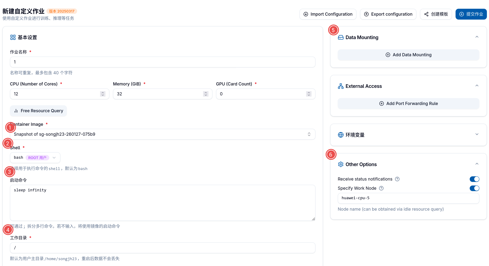

# How to Use `Dockerfile.gpu`?

## Local Build
### Docker Arguments
- `BUILD_PROXY`: proxy for building docker image, extremely helpful when downloading `libtorch`.
- `DEPLOY_PROXY`: proxy provided by crater for accessing internet with VPN.

### Build Docker Image
Before building the docker image, copy your SSH public key into `.secret`:
```bash
mkdir -p .secrets
cp ~/.ssh/id_rsa.pub .secrets/
```

Then, build the docker image
```bash
docker build -f container/Dockerfile.gpu.base \
-t <your-docker-image-tag> \
--network host \
--build-arg BUILD_PROXY="<your-https-proxy>" \
--build-arg DEPLOY_PROXY="http://192.168.5.58:1080" \
.
```

### Test Docker Image in a Container

#### Start a Bash Shell as Root (Admin)
In order to test it on your local machine, run the docker with interactive shell:

```bash
docker run --rm --network host -it <your-docker-image-tag> bash
```
This command will remove any existed container created from your image 
(delete `--rm` if you don't want it), start a bash shell and use your host network (127.0.0.1)

#### Add Teammate
In the bash shell, you can add teammate with `add_teammate` 
and it will ask you to provide ssh key from `~/.ssh/id_rsa.pub`:
```bash
add_teammate <username> <uid>
```

Then you can start a new terminal to do SSH login:
```bash
ssh <username>@localhost
```

## Crater 

### Upload
Log in
```bash
docker login gpu-harbor.act.buaa.edu.cn -u <harbor-username> -p <harbor-password>
```
Push your docker image to harbor
```bash
docker push <your-docker-image-tag>
```

### Custom Job Configuration


If you are the admin, login with ssh as root first:
```bash
ssh root@<ip> -p <port>
```

Everything else is the same as [what we did on the local machine](#add-teammate). 
